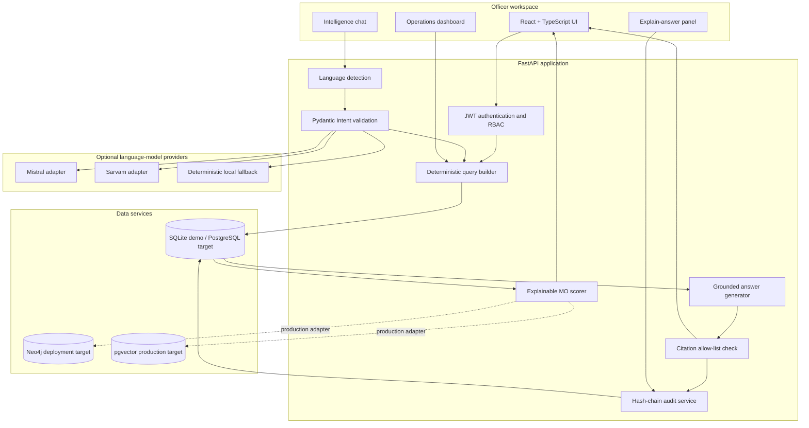
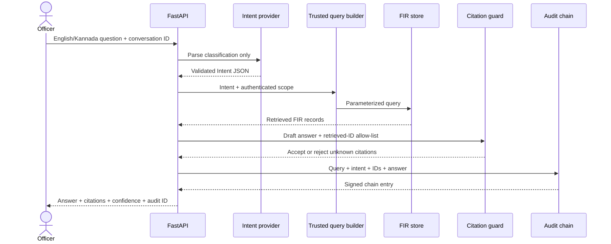
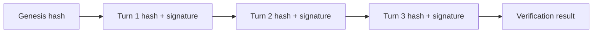

<div align="center">

# PRAHARI

### Grounded, bilingual crime intelligence for Karnataka law enforcement

**English + Kannada | Evidence-cited answers | Explainable case links | Auditable by design**


Built as a decision-support prototype for the **SCRB Karnataka Datathon**.

**Live Catalyst AppSail deployment:** [https://prahari-50043921178.development.catalystappsail.in](https://prahari-50043921178.development.catalystappsail.in)

</div>

---

> [!IMPORTANT]
> PRAHARI is a hackathon prototype operating entirely on synthetic data. It is not a predictive-policing system, does not calculate individual risk scores, and must not be used as the sole basis for an operational or legal decision.

## Table of contents

- [What PRAHARI does](#what-prahari-does)
- [Why this architecture matters](#why-this-architecture-matters)
- [Feature tour](#feature-tour)
- [System architecture](#system-architecture)
- [Grounded question-answering pipeline](#grounded-question-answering-pipeline)
- [Technology stack](#technology-stack)
- [Repository structure](#repository-structure)
- [Quick start](#quick-start)
- [API-key and provider configuration](#api-key-and-provider-configuration)
- [Demo accounts and RBAC](#demo-accounts-and-rbac)
- [API reference](#api-reference)
- [Synthetic dataset](#synthetic-dataset)
- [MO-similarity design](#mo-similarity-design)
- [Audit and integrity model](#audit-and-integrity-model)
- [Security and responsible-AI guardrails](#security-and-responsible-ai-guardrails)
- [Testing and verification](#testing-and-verification)
- [Judge demo walkthrough](#judge-demo-walkthrough)
- [Implemented versus scoped](#implemented-versus-scoped)
- [Troubleshooting](#troubleshooting)
- [Production hardening roadmap](#production-hardening-roadmap)

## What PRAHARI does

PRAHARI is a conversational crime-analysis workspace designed for investigators who need to search structured FIR data, identify cross-station patterns, and understand exactly where every answer came from.

An officer can ask questions such as:

- “How many IPC 420 cases are recorded in Mysuru?”
- “Show cases with a similar modus operandi to FIR-2024-0100.”
- “Find motorcycle-based jewellery-snatching incidents.”
- “ಮೈಸೂರು ಜಿಲ್ಲೆಯಲ್ಲಿ ಎಷ್ಟು ಪ್ರಕರಣಗಳು?”

PRAHARI then:

1. Detects whether the question is English, Kannada, or Kanglish.
2. Converts the question into a narrow, validated intent object.
3. Applies role and jurisdiction restrictions.
4. Executes an application-owned parameterized query.
5. Generates an answer using only the retrieved records.
6. Rejects citations that do not belong to the retrieved result set.
7. Stores the complete interaction in a signed, hash-chained audit record.

The platform prioritizes **groundedness, auditability, explainability, and operator control** over unrestricted generative output.

## Why this architecture matters

Many natural-language analytics demos allow an LLM to produce arbitrary SQL or Cypher. PRAHARI deliberately does not.

```text
Natural-language question
        |
        v
Validated, allow-listed Intent
        |
        v
Deterministic application query builder
        |
        v
Parameterized SQL / trusted retrieval
```

The model is allowed to classify a request, but it is never trusted to decide how the database should be queried. This boundary provides three practical protections:

- **Prompt-injection resistance:** user instructions cannot make the model output an executable destructive query.
- **Jurisdiction enforcement:** station and district scope is added from the authenticated user, independently of the prompt.
- **Reproducibility:** a validated intent maps to predictable query behavior that can be unit-tested and audited.

Treating model-generated free-text SQL or Cypher as executable would violate PRAHARI's core security contract.

## Feature tour

### Grounded bilingual intelligence chat

- English and Kannada input detection
- Narrow deterministic Kannada/Kanglish fallback parser
- Mistral and Sarvam provider adapters behind one interface
- FIR citation chips attached to generated claims
- Low/medium/high confidence label derived from retrieval evidence
- Safe “I don't have that information” behavior for empty results

### Explainable linked cases

- Finds cases sharing a modus-operandi pattern across different stations
- Excludes same-station candidates from cross-station discovery
- Returns a ranked score and specific shared elements
- Explains similarities such as `rear-window entry`, `night-time`, or `jewellery targeted`

### Jurisdiction-aware access control

- JWT authentication
- Four demonstration roles
- Station-scoped constable and SHO retrieval
- District-scoped SP retrieval
- Statewide SCRB administrator retrieval
- Enforcement occurs inside the trusted query builder, not only in the UI

### Verifiable evidence trail

- Records query, parsed intent, retrieved IDs, answer, timestamp, and user
- Chains every record to the previous interaction hash
- Signs each entry using an HMAC-SHA256 demonstration fallback
- Provides an “Explain this answer” panel with verification status

### Responsible operations dashboard

- Area-level case aggregation
- Visible fairness statement
- No individual suspicion score
- No automatic operational recommendation

### Human-controlled document ingestion

- Accepts a scanned-FIR file
- Returns a proposed structured extraction envelope
- Requires confirmation before persistence
- Keeps OCR/VLM integration explicitly identified as a scoped adapter

## System architecture



### Deployment topology

The included Compose file defines:

| Service | Purpose | Default port |
|---|---|---:|
| `frontend` | Nginx-served React production bundle | `5173` |
| `api` | FastAPI application | `8000` |
| `postgres` | PostgreSQL 16 with pgvector | `5432` |
| `neo4j` | Neo4j Community graph database | `7474`, `7687` |

The quickest local demonstration uses SQLite and needs neither PostgreSQL nor Neo4j. The Compose services establish the intended production-shaped topology; the implementation matrix below states where live database integration remains scoped.

## Grounded question-answering pipeline



### Constrained intent contract

```json
{
  "entity_type": "case",
  "relation": null,
  "filters": {
    "district": "Mysuru",
    "date_from": null,
    "date_to": null,
    "ipc_section": "420",
    "station": null,
    "keyword": null,
    "case_id": null
  },
  "requested_action": "aggregate",
  "language": "en"
}
```

Allowed actions are `lookup`, `aggregate`, `network`, and `similarity`. Values outside the schema fail validation and do not become database instructions.

## Technology stack

| Layer | Technology | Role |
|---|---|---|
| Frontend | React, TypeScript, Vite | Operator workspace and dashboard |
| UI assets | Lucide React, custom CSS | Accessible iconography and responsive visual system |
| API | Python 3.11+, FastAPI | HTTP endpoints and application orchestration |
| Validation | Pydantic | Intent and request/response contracts |
| ORM | SQLAlchemy 2 | Parameterized relational retrieval |
| Demo database | SQLite | Zero-infrastructure local experience |
| Target relational store | PostgreSQL 16 + pgvector | FIR, users, audit records, vector candidates |
| Target graph store | Neo4j 5 | Case/person/vehicle/weapon relationship graph |
| Authentication | JWT HS256 | Demonstration role identity |
| LLM adapters | Mistral API, Sarvam AI API | Optional constrained intent parsing |
| Test suite | Pytest, FastAPI TestClient | Grounding, audit, language, and seed verification |
| Runtime packaging | Docker, Docker Compose, Nginx | Reproducible multi-service deployment |

## Repository structure

```text
datathon/
|-- backend/
|   |-- app/
|   |   |-- audit.py            # hash-chain creation and verification
|   |   |-- auth.py             # JWT login and current-user resolution
|   |   |-- config.py           # typed environment configuration
|   |   |-- database.py         # engine and session lifecycle
|   |   |-- intent_parser.py    # provider interface + constrained parsers
|   |   |-- main.py             # API routes and lifespan initialization
|   |   |-- models.py           # SQLAlchemy relational models
|   |   |-- retrieval.py        # trusted scoped query construction
|   |   `-- seed.py             # deterministic 500-case demo dataset
|   |-- tests/
|   |   `-- test_core.py        # core integration tests
|   `-- Dockerfile
|-- frontend/
|   |-- src/
|   |   |-- App.tsx             # chat, dashboard, audit interface
|   |   `-- styles.css          # responsive PRAHARI design system
|   |-- package.json
|   `-- Dockerfile
|-- scripts/
|   `-- generate_synthetic_data.py
|-- docs/
|   `-- ARCHITECTURE.md
|-- data/                        # local DB and generated exports; ignored
|-- .env.example                # secret-free configuration template
|-- docker-compose.yml
|-- requirements.txt
`-- README.md
```

## Quick start

### Prerequisites

- Python 3.11 or newer
- Node.js 20 or newer
- npm 10 or newer
- Docker Desktop only if using the container path

### Option A: local development on Windows PowerShell

From the repository root:

```powershell
Copy-Item -Force .env.example .env
python -m pip install -r requirements.txt
$env:PYTHONPATH="backend"
python -m uvicorn app.main:app --reload --port 8000
```

Open a second PowerShell terminal:

```powershell
Set-Location frontend
cmd /c npm install
cmd /c npm run dev
```

The `cmd /c` prefix avoids the PowerShell execution-policy issue that can block `npm.ps1` on Windows.

### Option B: local development on macOS or Linux

```bash
cp .env.example .env
python3 -m venv .venv
source .venv/bin/activate
python -m pip install -r requirements.txt
PYTHONPATH=backend uvicorn app.main:app --reload --port 8000
```

In a second terminal:

```bash
cd frontend
npm install
npm run dev
```

### Option C: Docker Compose

```bash
cp .env.example .env
docker compose up --build
```

### Local URLs

| Resource | URL |
|---|---|
| PRAHARI UI | `http://localhost:5173` |
| FastAPI Swagger UI | `http://localhost:8000/docs` |
| OpenAPI JSON | `http://localhost:8000/openapi.json` |
| API health | `http://localhost:8000/api/health` |
| Neo4j Browser, when containerized | `http://localhost:7474` |

The backend creates its schema and seeds 500 cases during its first startup. Repeated startups do not duplicate those cases.

## API-key and provider configuration

### Current repository status

The Mistral and Sarvam **code adapters are integrated** in `backend/app/intent_parser.py`. The actual credentials are **not configured** in the current `.env`, and `LLM_PROVIDER` is currently `mock`.

This is intentional. API keys pasted into chat, screenshots, issue descriptions, or shared prompts must be considered exposed. Revoke those credentials in their provider dashboards and create replacements before configuring the project.

> [!CAUTION]
> Never place a key in `README.md`, source code, frontend environment variables, Dockerfiles, Git history, or screenshots. Any variable prefixed with `VITE_` becomes visible to browser users and must not contain a server API key.

### Safe configuration

1. Rotate the previously shared Mistral and Sarvam credentials.
2. Copy `.env.example` to `.env` if necessary.
3. Add only the new credentials to the local `.env` file.
4. Keep `.env` untracked; it is already listed in `.gitignore`.
5. Restart the API after switching providers.

For Mistral:

```dotenv
LLM_PROVIDER=mistral
MISTRAL_API_KEY=replace_with_a_new_rotated_key
SARVAM_API_KEY=
```

For Sarvam:

```dotenv
LLM_PROVIDER=sarvam
MISTRAL_API_KEY=
SARVAM_API_KEY=replace_with_a_new_rotated_key
```

For the fully offline deterministic demo:

```dotenv
LLM_PROVIDER=mock
MISTRAL_API_KEY=
SARVAM_API_KEY=
```

### Provider behavior

| Provider setting | Intent parser | Failure behavior |
|---|---|---|
| `mock` | Narrow deterministic parser | Always local |
| `mistral` | `mistral-small-latest` JSON intent request | Falls back locally on timeout, API error, malformed JSON, or validation failure |
| `sarvam` | `sarvam-m` chat-completion intent request | Falls back locally on timeout, API error, malformed JSON, or validation failure |

The current answer renderer remains deterministic and record-grounded for predictable demonstration behavior. A future remote answer generator must pass the same retrieved-ID citation guard before its response can leave the API.

### Verify configuration without revealing secrets

Call:

```bash
curl http://localhost:8000/api/health
```

Expected shape:

```json
{
  "status": "ok",
  "cases": 500,
  "llm_provider": "mock"
}
```

The health response reports the selected provider but never returns a key.

## Demo accounts and RBAC

All seeded demonstration accounts use password `demo1234`.

| Username | Role | Enforced query scope |
|---|---|---|
| `constable` | constable | Bengaluru Central Police Station |
| `sho` | station-SHO | Bengaluru Central Police Station |
| `sp` | district-SP | Mysuru district |
| `admin` | SCRB-admin | All seeded districts |

The visual prototype opens in anonymous statewide demonstration mode so judges can explore without a login interruption. The backend supports authenticated scoping through `/api/auth/token`.

### Request a token

```bash
curl -X POST http://localhost:8000/api/auth/token \
  -H "Content-Type: application/x-www-form-urlencoded" \
  -d "username=sp&password=demo1234"
```

### Use the token

```bash
curl -X POST http://localhost:8000/api/chat \
  -H "Authorization: Bearer YOUR_TOKEN" \
  -H "Content-Type: application/json" \
  -d '{
    "message": "How many IPC 420 cases are available?",
    "conversation_id": "rbac-demo"
  }'
```

The district restriction comes from the `sp` user record. Asking the model to ignore it cannot remove the query-builder predicate.

## API reference

### Endpoint summary

| Method | Endpoint | Purpose | Authentication |
|---|---|---|---|
| `GET` | `/api/health` | Service health, record count, selected provider | Optional |
| `POST` | `/api/auth/token` | Issue JWT for a seeded user | No |
| `POST` | `/api/chat` | Parse, retrieve, answer, cite, and audit | Optional demo / supported |
| `GET` | `/api/cases/{case_id}` | Return one FIR record | No in demo |
| `GET` | `/api/cases/{case_id}/similar` | Return ranked cross-station MO matches | Optional demo / supported |
| `GET` | `/api/audit/{conversation_id}` | Verify the conversation audit chain | No in demo |
| `GET` | `/api/dashboard` | Return scoped aggregate dashboard data | Optional demo / supported |
| `POST` | `/api/ingest/scanned-fir` | Upload a document for confirmation-first extraction | No in demo |

### Chat request

```http
POST /api/chat
Content-Type: application/json
```

```json
{
  "message": "How many IPC 420 cases are in Mysuru?",
  "conversation_id": "judge-demo-01",
  "language": "en"
}
```

`language` is optional. When omitted, PRAHARI detects English, Kannada, or supported Kanglish cues.

### Chat response

```json
{
  "answer": "The retrieved records contain 9 matching cases: [FIR-2025-0421], [FIR-2025-0181], [FIR-2025-0031], [FIR-2024-0001], [FIR-2024-0136].",
  "citations": [
    {
      "record_id": "FIR-2025-0421",
      "fir_number": "0421/2025",
      "district": "Mysuru",
      "station": "Mysuru Central PS"
    }
  ],
  "confidence": "high",
  "intent": {
    "entity_type": "case",
    "relation": null,
    "filters": {
      "district": "Mysuru",
      "date_from": null,
      "date_to": null,
      "ipc_section": "420",
      "station": null,
      "keyword": null,
      "case_id": null
    },
    "requested_action": "aggregate",
    "language": "en"
  },
  "audit_id": 1
}
```

### Similar-case response shape

```json
{
  "source": {
    "id": "FIR-2024-0100",
    "fir_number": "0100/2024"
  },
  "matches": [
    {
      "id": "FIR-2025-0118",
      "similarity": 0.81,
      "shared_elements": [
        "night-time",
        "rear-window entry",
        "jewellery targeted"
      ]
    }
  ],
  "method": "explainable synthetic-MO overlap; production embedding adapter is scoped"
}
```

### Audit response shape

```json
{
  "conversation_id": "judge-demo-01",
  "chain": [
    {
      "id": 1,
      "query": "How many IPC 420 cases are in Mysuru?",
      "record_ids": ["FIR-2025-0421"],
      "entry_hash": "...",
      "verified": true
    }
  ],
  "signature_scheme": "HMAC-SHA256 demo fallback; ML-DSA required in production"
}
```

The interactive Swagger page at `/docs` is the authoritative generated schema for every field.

## Synthetic dataset

No real SCRB data is bundled or required.

The deterministic seed generator creates:

- **500 synthetic FIRs**
- **15 Karnataka districts**
- **18 repeated MO clusters**
- English and Kannada narrative fields
- FIR number, station, incident date, IPC sections, status, and outcome
- Synthetic latitude and longitude near each seeded district station
- Fictional people and case roles
- Optional weapon and vehicle attributes
- Cross-station repeated patterns designed specifically for similarity demonstrations

Every English narrative states that it is a synthetic training case and represents no real incident or person. Synthetic coordinates and identifiers must not be interpreted as real operational data.

### Included districts

`Bengaluru Urban`, `Mysuru`, `Belagavi`, `Mangaluru`, `Shivamogga`, `Tumakuru`, `Dharwad`, `Ballari`, `Kalaburagi`, `Udupi`, `Hassan`, `Mandya`, `Kodagu`, `Kolar`, and `Davanagere`.

### Example MO clusters

- Night-time residential housebreaking
- Highway cargo interception
- ATM card distraction
- Temple donation-box theft
- Warehouse roof entry
- Motorcycle jewellery snatching
- OTP impersonation fraud
- Agricultural copper-wire theft
- Bus pickpocketing
- Construction-site equipment theft

### Generate inspectable exports

Windows PowerShell:

```powershell
$env:PYTHONPATH="backend"
python scripts/generate_synthetic_data.py
```

macOS/Linux:

```bash
PYTHONPATH=backend python scripts/generate_synthetic_data.py
```

Outputs are written to:

```text
data/generated/seed.sql
data/generated/seed.cypher
```

The generated artifacts are ignored by Git because they can always be reproduced from the fixed random seed.

## MO-similarity design

The demonstration scorer favors inspectability over an opaque “AI score.” For a source case, it:

1. Loads the structured MO elements.
2. Retrieves candidate cases within the user's jurisdiction.
3. Excludes the source case.
4. Excludes cases filed at the same station.
5. Computes shared structured MO elements.
6. Adds a synthetic-cluster bonus when appropriate.
7. Returns only candidates above the demonstration threshold.
8. Sorts matches by score and returns the specific overlap.

This makes the explanation visible to an investigator. A production implementation should use multilingual sentence embeddings only as a candidate-recall layer, calibrate thresholds against investigator-reviewed pairs, and keep structured features as the explanation layer.

The prototype does not claim that its synthetic similarity score is calibrated for real crime data.

## Audit and integrity model

Each chat turn stores:

- Conversation ID
- User ID, when authenticated
- Original query
- Validated intent
- Retrieved record IDs
- Returned answer
- UTC timestamp
- Previous entry hash
- Current entry hash
- Signature

The entry hash uses canonical JSON and SHA-256. Each entry includes the previous hash, making deletion, reordering, or mutation detectable during chain verification. The current signature is HMAC-SHA256.



This mechanism is not described as a blockchain: it has no distributed consensus or independent validator set. It is also not yet post-quantum signed. The production design calls for ML-DSA through `liboqs-python` and independently controlled append-only anchors.

## Security and responsible-AI guardrails

### Enforced in the current code

- LLMs cannot submit query text to the database.
- Intent fields are validated before retrieval.
- SQLAlchemy produces bound query parameters.
- User scope is appended by trusted server code.
- Unknown bracketed FIR citations are rejected.
- Empty retrievals produce an explicit no-information answer.
- API secrets stay server-side.
- `.env`, local databases, build output, and generated data are Git-ignored.
- Scanned-FIR ingestion does not autonomously persist extracted content.
- The dashboard uses geographic aggregates rather than individual scoring.

### Required before real deployment

- Replace demo passwords, JWT secret, and audit signing key.
- Use an enterprise identity provider and short-lived tokens.
- Require authentication on all record and audit endpoints.
- Add endpoint-level authorization policies and rate limits.
- Encrypt data at rest and in transit.
- Add secrets management instead of long-lived `.env` credentials.
- Deploy PostgreSQL row-level security as defense in depth.
- Add immutable external audit anchoring and ML-DSA signatures.
- Establish data retention, redaction, deletion, and legal-hold policies.
- Complete privacy, bias, security, and operational impact reviews.
- Evaluate Kannada translation and retrieval quality on approved test data.
- Require human review for every operational inference.

## Testing and verification

### Backend tests

Windows PowerShell:

```powershell
$env:PYTHONPATH="backend"
python -m pytest backend/tests -q
```

macOS/Linux:

```bash
PYTHONPATH=backend python -m pytest backend/tests -q
```

Current verified result:

```text
3 passed
```

The tests cover:

- Startup and deterministic 500-record seeding
- Constrained IPC/district intent parsing
- Grounded chat response generation
- Rejection boundary for non-retrieved citations
- Audit-chain creation and verification
- Kannada language detection
- Similarity endpoint availability

### Frontend production build

```powershell
Set-Location frontend
cmd /c npm run build
```

Current verified result:

```text
TypeScript compilation: passed
Vite production build: passed
```

### Manual smoke test

```bash
curl http://localhost:8000/api/health
```

Then submit a chat question through the UI, open a citation chip, and use **Explain this answer** to verify the interaction chain.

## Judge demo walkthrough

This sequence takes approximately four minutes.

### 1. Establish trust and scope

Open the chat page and explain:

> “PRAHARI never lets the language model write a database query. The model can only create this validated intent, and every answer must cite records that were actually retrieved.”

### 2. Demonstrate grounded aggregation

Ask:

```text
How many IPC 420 cases are in Mysuru?
```

Point out the parsed district and IPC filter, confidence label, and expandable FIR citation chips.

### 3. Demonstrate bilingual access

Ask:

```text
ಮೈಸೂರು ಜಿಲ್ಲೆಯಲ್ಲಿ ಎಷ್ಟು ಪ್ರಕರಣಗಳು?
```

Explain that the offline parser keeps the demo available without external APIs, while the provider switch enables Mistral or Sarvam for broader language coverage.

### 4. Demonstrate cross-station discovery

Open a known case and call its `/similar` endpoint. Highlight that PRAHARI returns the shared MO elements, not only an unexplained score.

### 5. Demonstrate auditability

Select **Explain this answer**. Show the original question, retrieved-record count, entry-hash fragment, and verified status.

### 6. Demonstrate ethical boundaries

Open **Operations Overview** and show the fairness notice:

> “Only area-level aggregates are shown. PRAHARI does not produce individual risk scores.”

### 7. Close honestly

State that all data is synthetic, similarity accuracy is not benchmarked on real FIRs, and the implementation table distinguishes the working core from production adapters.

## Implemented versus scoped

| Capability | Status | Notes |
|---|---|---|
| Repository and service scaffolding | **Implemented** | Backend, frontend, scripts, docs, Compose |
| Responsive operator chat UI | **Implemented** | English/Kannada toggle, suggestions, citations, audit modal |
| Operations overview UI | **Implemented** | Aggregate counts and fairness note |
| 500-case synthetic seed | **Implemented** | Deterministic, fictional, 15 districts |
| SQLAlchemy relational schema | **Implemented** | FIR, station, person, case-person, user, audit |
| Intent schema | **Implemented** | Validated Pydantic model and action enum |
| Deterministic query builder | **Implemented** | Parameterized application-owned retrieval |
| Citation allow-list | **Implemented and tested** | Unknown FIR citations are rejected |
| English/Kannada fallback parsing | **Implemented** | Narrow deterministic coverage |
| Mistral provider adapter | **Implemented, not credentialed** | Falls back locally on failure |
| Sarvam provider adapter | **Implemented, not credentialed** | Falls back locally on failure |
| Remote grounded answer generation | **Scoped** | Current renderer is deterministic |
| JWT demonstration authentication | **Implemented** | Four seeded demo identities |
| Query-layer jurisdiction scope | **Implemented** | Station, district, statewide rules |
| UI login workflow | **Scoped** | Backend token endpoint is operational |
| Explainable MO matching | **Implemented** | Cross-station structured overlap |
| Multilingual embedding retrieval | **Scoped** | pgvector candidate layer planned |
| Live Neo4j dual-write | **Scoped** | Container and Cypher export are present |
| Interactive graph visualization | **Scoped** | API data path precedes UI graph work |
| Hash-chained audit | **Implemented and tested** | Complete turn provenance |
| HMAC demonstration signing | **Implemented** | Uses server-side signing key |
| ML-DSA post-quantum signing | **Scoped** | Requires `liboqs-python` and managed keys |
| Confirmation-first ingestion API | **Implemented** | Never automatically persists |
| OCR/Pixtral extraction | **Scoped** | Adapter response is explicitly labeled |
| IndicTrans2 translation | **Scoped** | Deterministic Kannada path works offline |
| Hotspot map rendering | **Scoped** | Aggregate dashboard data is implemented |
| Automated PDF export | **Scoped** | Not part of current working core |

## Troubleshooting

<details>
<summary><strong>PowerShell says npm.ps1 cannot be loaded</strong></summary>

Use the Windows command shim:

```powershell
cmd /c npm install
cmd /c npm run dev
```

</details>

<details>
<summary><strong>Python cannot import app</strong></summary>

Run commands from the repository root and set the backend path:

```powershell
$env:PYTHONPATH="backend"
python -m uvicorn app.main:app --reload
```

</details>

<details>
<summary><strong>The UI reports that the intelligence service is unavailable</strong></summary>

Confirm that the API is running on port 8000 and that this returns JSON:

```bash
curl http://localhost:8000/api/health
```

If the API uses another address, set `VITE_API_URL` before starting or building the frontend.

</details>

<details>
<summary><strong>A configured provider still behaves like mock mode</strong></summary>

Check all of the following:

1. `LLM_PROVIDER` exactly matches `mistral` or `sarvam`.
2. The corresponding key is present in the backend `.env`.
3. The API was restarted after editing `.env`.
4. The provider endpoint is reachable.
5. The provider response conforms to the intent schema.

Provider errors intentionally fall back to the local parser. This keeps the application available without weakening the database safety boundary.

</details>

<details>
<summary><strong>The database contains fewer or unexpected records</strong></summary>

The seed routine does not overwrite an existing database. Stop the API and move the local demo database out of `data/` if you intentionally want a fresh seed. Do not remove a database that contains user data without first making a backup.

</details>

<details>
<summary><strong>Docker cannot access its configuration</strong></summary>

Ensure Docker Desktop is running and that the current Windows user can read the Docker configuration directory. A local Python/Node launch remains available when Docker Desktop is restricted by machine policy.

</details>

## Production hardening roadmap

### Data and retrieval

- Migrate the source of truth to PostgreSQL.
- Add pgvector multilingual narrative embeddings.
- Implement Neo4j dual-write with retry and reconciliation.
- Add schema migrations through Alembic.
- Add approved data-quality and deduplication rules.
- Add temporal, geographic, and station hierarchy filters.

### Language intelligence

- Integrate reviewed IndicTrans2 translation/normalization.
- Build a Kannada and Kanglish evaluation set with domain experts.
- Add contextual follow-up resolution across the last five turns.
- Benchmark provider intent accuracy, grounding, and abstention.
- Add Bhashini-compatible ASR/TTS adapters.

### Security and governance

- Integrate enterprise SSO and multi-factor authentication.
- Enforce authentication across every endpoint.
- Add PostgreSQL row-level security and field-level redaction.
- Move secrets into a managed vault.
- Add tamper-resistant external audit anchoring.
- Implement ML-DSA signing with managed post-quantum keys.
- Conduct threat modeling, penetration testing, and privacy review.

### Operator experience

- Add interactive case/person network visualization.
- Add an aggregate-only Leaflet hotspot map.
- Add reviewed scanned-FIR OCR with field-level confidence.
- Add accessible PDF evidence-package export.
- Add saved investigations and approval workflows.
- Add visible data freshness and provenance indicators.

## Further documentation

Read [`docs/ARCHITECTURE.md`](docs/ARCHITECTURE.md) for the critical design rationale behind constrained intents, aggregate-only analytics, similarity explanations, and audit/PQC boundaries.

## Datathon submission package

The teammate-ready submission material is organized under [`deliverables/`](deliverables/):

- [`01_presentation_template`](deliverables/01_presentation_template/) contains the original KSP Datathon PPTX, exact content for all 16 slides, speaker notes, visual-design guidance, extracted template artwork, and four editable SVG diagrams/charts.
- [`02_prototype_and_deployment`](deliverables/02_prototype_and_deployment/) explains the complete idea, provides a three-minute demo and judge Q&A script, documents the AppSail deployment workflow, and includes the final submission checklist.

The qualifying Catalyst container is defined by [`Dockerfile.catalyst`](Dockerfile.catalyst). It compiles React and serves it from the FastAPI process on Catalyst's `X_ZOHO_CATALYST_LISTEN_PORT`, producing one same-origin AppSail link. The Linux AMD64 image has been built and smoke-tested locally; remote deployment requires an authenticated promotion-linked Catalyst project.

The Development AppSail endpoint is deployed and verified. Before final evaluation, use the Catalyst console's **Deploy to Production** workflow and replace the development link with the resulting production endpoint if the submission rules require production rather than a publicly accessible Development deployment.

---

<div align="center">

**PRAHARI — evidence before eloquence.**

All included records, people, identifiers, and incidents are synthetic and fictional.

</div>
